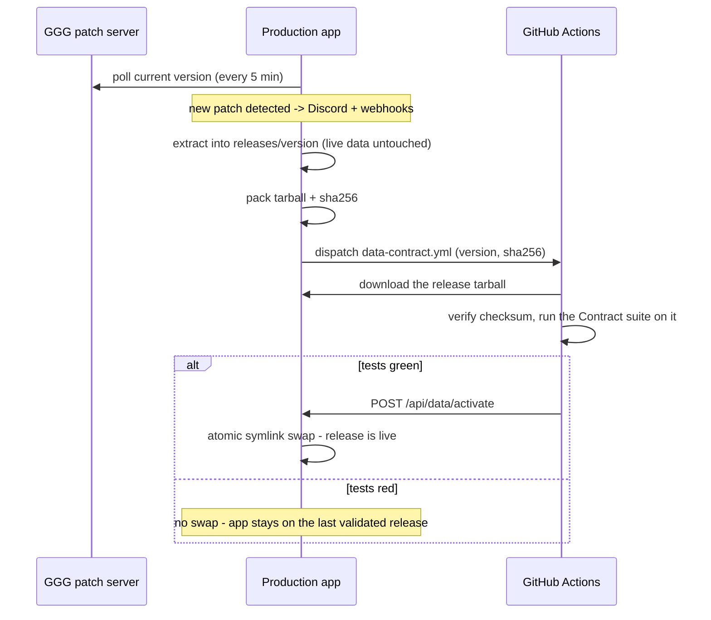

# Exile to Exile

*A free, open-source companion for Path of Exile 2 builds.*

<br clear="left">


[](LICENSE)
[](https://discord.gg/mNcjdkcBFB)

**Live:** https://poe.rajtik.com · **Discord:** https://discord.gg/mNcjdkcBFB

Import your Path of Exile 2 character, point it at a build you're following, and
get a concrete **diff** - what's missing or different across your passive tree,
your skill gems and supports, and your equipped item mods. No more checking a
guide act by act to see whether you picked the wrong support gem or skipped a
passive.

There isn't a dedicated tool for this in the PoE2 ecosystem yet, and that diff
layer is the whole point. It's a fan project: free, no ads, no monetization.

## Features

Working today:

- **Passive tree** - a full interactive PoE2 tree with allocation and shareable links.
- **Build planner** - plan a build, save it, share it.
- **Loot-filter generator** - custom in-game filters built on NeverSink, with
  highlights tuned to live market prices and your build.
- **Build import** - load a build from a Path of Building code.
- **Patch notifications** - subscribe to hear when a new PoE2 patch drops.

On the roadmap:

- **Character &harr; guide diff** - the headline feature: pull your live character
  through the GGG account API and compare it against a target build from Maxroll,
  Mobalytics, poe.ninja or pobb.in.

## Tech stack

- **Backend:** Laravel 13, PHP 8.4
- **Frontend:** Inertia v3, React 19, Tailwind v4, shadcn/ui
- **Tests:** Pest 4
- Built on Laravel's React starter kit.

A map of the codebase lives in [`docs/ARCHITECTURE.md`](docs/ARCHITECTURE.md).

## Game data

All PoE2 game data - passive tree, gems, items, mods and icons - is extracted
straight from the official GGPK / patch server by
[poe2-toolkit](https://github.com/rajtik76/poe2-toolkit) - my own open-source (MIT)
`@poe2-toolkit/*` npm packages for framework-agnostic GGPK extraction - driven from the pipeline in
[`tools/poe-data-extract`](tools/poe-data-extract). No third-party data dumps or
scrapes. Market prices come from [poe2scout](https://poe2scout.com). The loot
filter builds on [NeverSink's filter](https://github.com/NeverSinkDev/NeverSink-Filter).

### From patch to production

Game data is not committed to this repository. It ships through a
build-once-promote pipeline: the release that goes live is byte for byte the
one that passed CI.



How it holds together:

- The app serves data through a single `current` symlink
  (`storage/game-data/current -> releases/<version>`). Activation is one atomic
  `rename`, so a request never sees a half-switched release. Old releases stay
  on disk as instant rollback targets (`POST /api/data/activate` with an older
  staged version swaps back without re-extracting).
- The Contract suite ([`tests/Contract`](tests/Contract)) guards the app <->
  data contract against the real extract: tree structure, icons on disk, PoB
  import, seeded plans. Ordinary pushes to `main` run it too, against the
  release production currently serves (downloaded from the app, never
  re-extracted), so a code change that breaks the contract cannot land green.
- CI never touches the GGPK: it validates the exact artifact the server staged.
  A manual `workflow_dispatch` of
  [`data-contract.yml`](.github/workflows/data-contract.yml) with
  `mode=extract` runs the full GGPK extraction instead - use it for changes to
  the extractor itself.
- Every failure mode ends in "no swap": red tests, a missing tarball or an
  unreachable server leave production on the last validated release. The
  watcher re-dispatches a stalled validation at most once per six hours.

The moving parts: the `poe2:watch-patch` command (detection + notifications),
the `StageGameData` and `TriggerContractRun` jobs, the `GameDataReleases`
service (release store, atomic swap, pruning), the token-gated
`POST /api/data/activate` endpoint, and the `poe2:link-game-data` /
`poe2:pack-release` commands for deploy wiring and tarball repair. Deployment
needs `GITHUB_DISPATCH_TOKEN`, `GITHUB_REPOSITORY` and `POE_DATA_ACTIVATE_TOKEN`
in the app environment, plus the `DATA_BASE_URL` variable and
`DATA_ACTIVATE_TOKEN` secret on the GitHub side (see
[`.env.example`](.env.example)).

## Local development

Requires PHP 8.4, Composer and Node 22.

```bash
composer install
npm install
cp .env.example .env
php artisan key:generate
php artisan migrate
npm run refresh:data   # extract game data from the GGPK patch CDN (~10 min, ~GBs cached)
composer run dev       # Vite + PHP server + queue worker, together
```

Then open the URL the dev command prints. The data extraction is needed once
per patch; it writes the passive tree, icons and item/gem data the app serves
(see "Game data" above).

The newsletter signup's [captchaapi.eu](https://captchaapi.eu) captcha is off
by default (`CAPTCHAAPI_ENABLED=false` in `.env.example`) - no site key needed
to run the app locally. Set `CAPTCHAAPI_ENABLED=true` plus `CAPTCHAAPI_SITE_KEY`
and `CAPTCHAAPI_SECRET_KEY` from your own
[captchaapi.eu dashboard](https://captchaapi.eu/dashboard) to exercise it.  
captchaapi.eu is a sibling project of mine, disclosed here for transparency;
it was picked on its own merits (EU-hosted, no cookies, no tracking) and the
integration is a plain HTTP call any captcha service could sit behind.

## Running tests

The suites differ in what they need on your machine:

```bash
composer test:exclude-snapshots   # Unit + Feature: no game data needed, runs anywhere
composer test:contract            # Contract: needs the real extracted game data (npm run refresh:data)
composer test:update-snapshots    # Browser: needs Playwright (npx playwright install chromium)
composer test                     # everything at once
```

Unit and Feature tests mock all external data, so they are the ones to run on a
fresh clone and the ones CI runs for pull requests. Contract tests validate the
app against the real GGPK extract; Browser tests drive a real browser through
Playwright. Quality checks (eslint, prettier, tsc, pint, rector, phpstan) plus
the JS and PHP test suites run together via `composer review`, which is also the
pre-commit hook.

## Development notes

I'm a Laravel / PHP developer, so this is built on Laravel's React starter kit. I
chose React to learn it - I'm comfortable with Vue and wanted the practice. The
PHP backend I wrote and reviewed by hand; the React frontend was built largely
with AI assistance. Bug reports and issues are welcome - I maintain this and can
support it. If you want to contribute code, see [CONTRIBUTING.md](CONTRIBUTING.md).

## License

The code is released under the MIT License (see [`LICENSE`](LICENSE)). The bundled
NeverSink filters are MIT (`resources/neversink/LICENSE`). `public/captchaapi-logo.svg`
is the captchaapi.eu brand mark, used with permission for attribution on the
newsletter form; it is not covered by this repository's MIT license.

Path of Exile 2 game data, text and art are &copy; Grinding Gear Games, used here
under GGG's fan-content policy for a free, non-commercial community tool with no
official affiliation. Full source breakdown:
[`resources/poe2/ATTRIBUTION.md`](resources/poe2/ATTRIBUTION.md).
