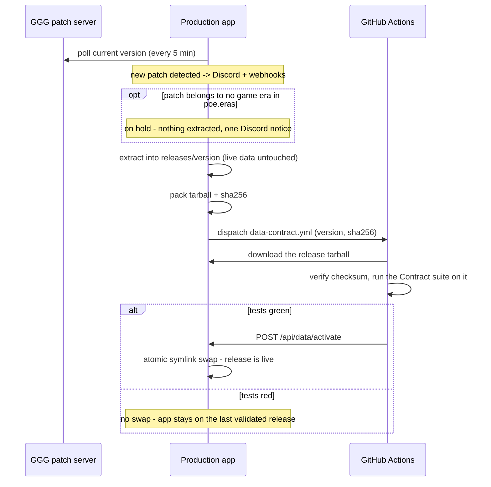

# Exile to Exile

*A free, open-source companion for Path of Exile 2 builds.*

<br clear="left">


[](LICENSE)

**Live:** https://poe.rajtik.com

Import your Path of Exile 2 character, point it at a build you're following, and
get a concrete **diff** - what's missing or different across your passive tree,
your skill gems and supports, and your equipped item mods. No more checking a
guide act by act to see whether you picked the wrong support gem or skipped a
passive.

There isn't a dedicated tool for this in the PoE2 ecosystem yet, and that diff
layer is the whole point. It's a fan project: free, no ads, no monetization.

## Features

Working today:

- **Passive tree** - a full interactive PoE2 tree with allocation and shareable links.
- **Build planner** - plan a build, save it, share it.
- **Loot-filter generator** - custom in-game filters built on NeverSink, with
  highlights tuned to live market prices and your build.
- **Build import** - load a build from a Path of Building code.
- **Patch notifications** - subscribe to hear when a new PoE2 patch drops.

On the roadmap:

- **Character &harr; guide diff** - the headline feature: pull your live character
  through the GGG account API and compare it against a target build from Maxroll,
  Mobalytics, poe.ninja or pobb.in.

## Build planner

Plan a build with the full tree, skill gems and item editor, then save and share it.


## Tech stack

- **Backend:** Laravel 13, PHP 8.4
- **Database/cache/queue:** PostgreSQL, Redis
- **Frontend:** Inertia v3, React 19, TypeScript, Tailwind v4, shadcn/ui, Vite
- **Tests:** Pest 5 (Unit/Feature/Contract), Vitest, E2E via Pest's Browser plugin (Playwright)
- Built on Laravel's React starter kit.

A map of the codebase lives in [`docs/ARCHITECTURE.md`](docs/ARCHITECTURE.md).

## Game data

All PoE2 game data - passive tree, gems, items, mods and icons - is extracted
straight from the official GGPK / patch server by
[poe2-toolkit](https://github.com/rajtik76/poe2-toolkit) - my own open-source (MIT)
`@poe2-toolkit/*` npm packages for framework-agnostic GGPK extraction - driven from the pipeline in
[`tools/poe-data-extract`](tools/poe-data-extract). No third-party data dumps or
scrapes. Market prices come from [poe2scout](https://poe2scout.com). The loot
filter builds on [NeverSink's filter](https://github.com/NeverSinkDev/NeverSink-Filter).

One documented exception: unique item mods aren't in GGG's own data files - the
game composes a unique's rolls at runtime rather than shipping them in the
patch. The `poe2:sync-pob-uniques` command refreshes them daily from
[Path of Building](https://github.com/PathOfBuildingCommunity/PathOfBuilding-PoE2)'s
community-maintained data (MIT, see [`resources/pob-uniques`](resources/pob-uniques))
into `storage/game-data/pob-uniques`, outside the GGPK release symlink so a
patch swap never touches it - unique mods update on their own cadence, not the
patch cycle. Full credits on the app's Credits & Licenses page.

### From patch to production

Game data is not committed to this repository. It ships through a
build-once-promote pipeline: the release that goes live is byte for byte the
one that passed CI.


```mermaid
sequenceDiagram
    participant GGG as GGG patch server
    participant App as Production app
    participant CI as GitHub Actions

    App->>GGG: poll current version (every 5 min)
    Note over App: new patch detected -> Discord + webhooks
    opt patch belongs to no game era in poe.eras
        Note over App: on hold - nothing extracted, one Discord notice
    end
    App->>App: extract into releases/version (live data untouched)
    App->>App: pack tarball + sha256
    App->>CI: dispatch data-contract.yml (version, sha256)
    CI->>App: download the release tarball
    CI->>CI: verify checksum, run the Contract suite on it
    alt tests green
        CI->>App: POST /api/data/activate
        App->>App: atomic symlink swap - release is live
    else tests red
        Note over App: no swap - app stays on the last validated release
    end
```

How it holds together:

- The app serves data through a single `current` symlink
  (`storage/game-data/current -> releases/<version>`). Activation is one atomic
  `rename`, so a request never sees a half-switched release. Old releases stay
  on disk as instant rollback targets (`POST /api/data/activate` with an older
  staged version swaps back without re-extracting).
- The Contract suite ([`tests/Contract`](tests/Contract)) guards the app <->
  data contract against the real extract: tree structure, icons on disk, PoB
  import, seeded plans. Ordinary pushes to `main` run it too, against the
  release production currently serves (downloaded from the app, never
  re-extracted), so a code change that breaks the contract cannot land green.
- CI never touches the GGPK: it validates the exact artifact the server staged.
  A manual `workflow_dispatch` of
  [`data-contract.yml`](.github/workflows/data-contract.yml) with
  `mode=extract` runs the full GGPK extraction instead - use it for changes to
  the extractor itself.
- Every failure mode ends in "no swap": red tests, a missing tarball or an
  unreachable server leave production on the last validated release. The
  watcher re-dispatches a stalled validation at most once per six hours.
- The watcher only stages a release when the GGG patch version itself moves,
  so a change to the extractor packages alone (a `@poe2-toolkit/*` bump) is
  never exercised against production data on its own - the pinned patch did
  not change, so nothing re-triggers `StageGameData`. Run
  `php artisan poe2:restage-data [version] [--force]` to stage it by hand:
  without `--force` it behaves like the watcher's stalled-validation nudge
  (re-triggers CI on the already staged data), with `--force` it re-runs the
  GGPK extraction even though the version is already staged. Either way it
  still goes through the same CI Contract gate before anything is activated.

### Game eras

A saved tree or build guide only makes sense on the data it was made on. When
PoE2 moves to a new era (0.5 to 1.0), node ids, items and mods change, and an
old build drawn over the new tree would show the wrong thing. So every saved
tree and plan stores the raw GGG patch of the live data it was last saved on,
read on the server (never taken from the client), and its game era is derived
from that patch.

- The era comes from a hand-maintained map in [`config/poe.php`](config/poe.php):
  raw patch prefix => era, optionally with the name GGG gave it, e.g.
  `'4.5' => ['era' => '0.5', 'name' => 'Return of the Ancients']`. It is never
  derived from the number alone: GGG's raw build numbering does not map onto
  the player-facing version predictably, so an era change is a human call.
  Prefixes need at least `major.minor`; the longest match on whole segments
  wins. Since builds store the patch, not the era, correcting the map re-files
  every build at once.
- A patch that matches no prefix is put on hold before anything is downloaded.
  Nothing is extracted or sent to CI, the site stays on its current data, and
  one Discord notice asks for the prefix to be mapped. The activation endpoint
  refuses such a release too (409), and the Contract suite fails on it.
- Activating the first release of a new era freezes the outgoing one under
  `storage/game-data/archive/<patch>` (hard links, plus the PoB unique mods).
  Each era keeps a single archive, the last release that was live in it;
  pruning never reaches the archive.
- A tree or plan from another era is read-only: its page shows a stand-in
  instead of drawing it over the live tree, its JSON carries `archived: true`,
  and editing, the loot filter and `/tree?from=` are off for it. One whose
  patch no longer maps to any era shows an error page asking the visitor to
  get in touch, and is logged. The editors send the patch they loaded with,
  which the server only compares, so a tab opened before a swap to a new era
  cannot save an old allocation.

To start a new era: adapt the extractor if the data format changed, add the
new prefix to `poe.eras` and deploy. The watcher's next nudge (or
`poe2:restage-data`) then extracts and validates it like any other patch.

The moving parts: the `poe2:watch-patch` command (detection + notifications),
the `StageGameData` and `TriggerContractRun` jobs, the `GameDataReleases`
service (release store, atomic swap, pruning, era archives), the `GameEra`
support class (the `poe.eras` map), the token-gated
`POST /api/data/activate` endpoint, and the `poe2:link-game-data` /
`poe2:pack-release` / `poe2:restage-data` commands for deploy wiring, tarball
repair and manual re-staging. Deployment
needs `GITHUB_DISPATCH_TOKEN`, `GITHUB_REPOSITORY` and `POE_DATA_ACTIVATE_TOKEN`
in the app environment, plus the `DATA_BASE_URL` variable and
`DATA_ACTIVATE_TOKEN` secret on the GitHub side (see
[`.env.example`](.env.example)).

## Local development

Requires PHP 8.4, Composer and Node 22.

```bash
composer install
npm install
cp .env.example .env
php artisan key:generate
php artisan migrate
npm run refresh:data   # extract game data from the GGPK patch CDN (~10 min, ~GBs cached)
composer run dev       # Vite + PHP server + queue worker, together
```

Then open the URL the dev command prints. The data extraction is needed once
per patch; it writes the passive tree, icons and item/gem data the app serves
(see "Game data" above).

The newsletter signup's [captchaapi.eu](https://captchaapi.eu) captcha is off
by default (`CAPTCHAAPI_ENABLED=false` in `.env.example`) - no site key needed
to run the app locally. Set `CAPTCHAAPI_ENABLED=true` plus `CAPTCHAAPI_SITE_KEY`
and `CAPTCHAAPI_SECRET_KEY` from your own
[captchaapi.eu dashboard](https://captchaapi.eu/dashboard) to exercise it.  
captchaapi.eu is a sibling project of mine, disclosed here for transparency;
it was picked on its own merits (EU-hosted, no cookies, no tracking) and the
integration is a plain HTTP call any captcha service could sit behind.

## Running tests

The suites differ in what they need on your machine:

```bash
composer test:exclude-snapshots   # Unit + Feature: no game data needed, runs anywhere
composer test:contract            # Contract: needs the real extracted game data (npm run refresh:data)
composer test:browser             # Browser: needs Playwright, the game data and a built frontend
composer test                     # everything at once
```

Unit and Feature tests mock all external data, so they are the ones to run on a
fresh clone and the ones CI runs for pull requests. Contract tests validate the
app against the real GGPK extract. Browser tests drive a real browser through
Playwright: they render pages that read the game data, and they load the compiled
frontend, so run `npm run build` after changing anything under `resources/js` or
they measure the previous bundle. Quality checks (eslint, prettier, tsc, pint,
rector, phpstan) plus the JS and PHP test suites run together via
`composer review`, which is also the pre-commit hook.

## Development notes

I'm a Laravel / PHP developer, so this is built on Laravel's React starter kit. I
chose React to learn it - I'm comfortable with Vue and wanted the practice. The
PHP backend I wrote and reviewed by hand; the React frontend was built largely
with AI assistance. Bug reports and issues are welcome - I maintain this and can
support it. If you want to contribute code, see [CONTRIBUTING.md](CONTRIBUTING.md).

## License

The code is released under the MIT License (see [`LICENSE`](LICENSE)). The bundled
NeverSink filters are MIT (`resources/neversink/LICENSE`). `public/captchaapi-logo.svg`
is the captchaapi.eu brand mark, used with permission for attribution on the
newsletter form; it is not covered by this repository's MIT license.

Path of Exile 2 game data, text and art are &copy; Grinding Gear Games, used here
under GGG's fan-content policy for a free, non-commercial community tool with no
official affiliation. Full source breakdown:
[`resources/poe2/ATTRIBUTION.md`](resources/poe2/ATTRIBUTION.md).
